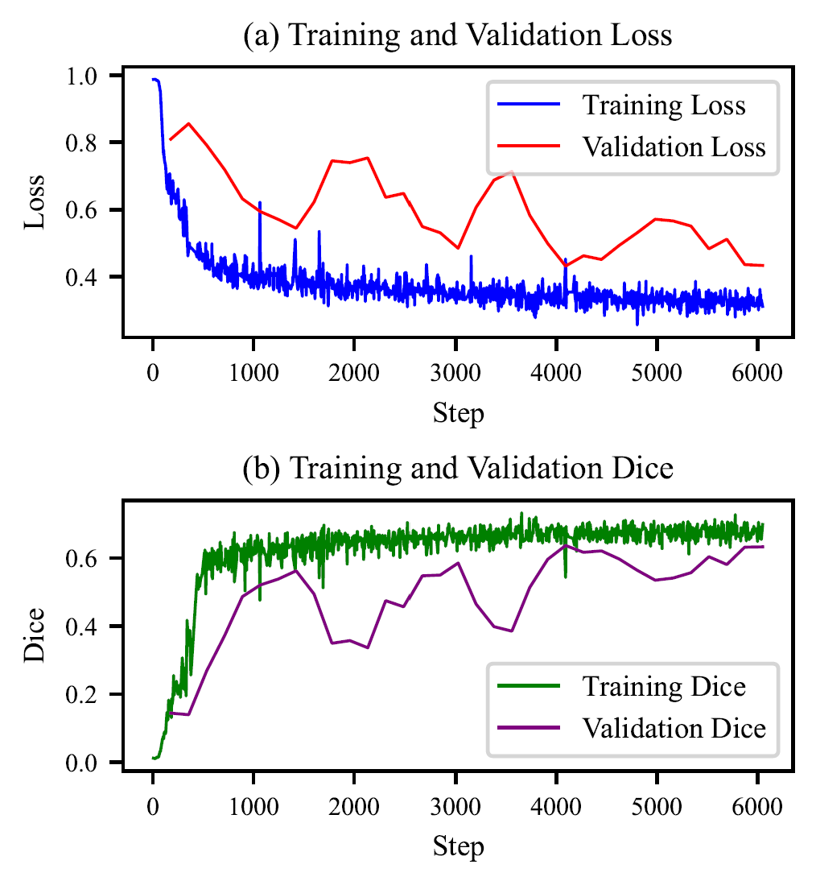

## 2024.04.15

### 【本周工作总结】

1. AIDA 会议，收获最大的报告：刘超老师。
2. FCN4Flare 论文 performance 章节撰写。

### 【下周工作计划】

1. 论文修改。

## 2024.04.15 - 2024.04.21

### Paper revision

1. `Detection performance` subsection
    - Added introduction of metrics (R, P, F1, AP, AUC, IoU, Dice).
    - Modified description of metrics table to highlight the P, AP, IoU and Dice metrics.
2. `NaN Mask` subsection
    - Removed paragraphs on data padding for leading to misunderstanding easily.
    - Focused on automated handling of NaN values within light curves instead of manually handling them in previous works.
3. `Data and Training` subsection
    - Figure of loss & dice during training & valuation.
    - Specify the total training time, device, config, etc.

### Code Recording

#### 1. Loss (or other metrics) with smoothing.

```python
import matplotlib.pyplot as plt
import pandas as pd
import numpy as np

# Function to smooth the curves with boundary adjustments
def smooth_with_padding(y, box_pts):
    box = np.ones(box_pts) / box_pts
    # Padding the start and end of the data to prevent boundary issues
    y_padded = np.pad(y, pad_width=(box_pts//2, box_pts//2), mode='edge')
    y_smooth = np.convolve(y_padded, box, mode='valid')
    return y_smooth

# Load each CSV file which is export from tensorboard
train_loss = pd.read_csv('./train_loss.csv')
train_dice = pd.read_csv('./train_dice.csv')
val_dice = pd.read_csv('./val_dice.csv')
val_loss = pd.read_csv('./val_loss.csv')

# Applying the adjusted smoothing function
train_loss_smooth_pad = smooth_with_padding(train_loss['Value'], 1)
val_loss_smooth_pad = smooth_with_padding(val_loss['Value'], 3)
train_dice_smooth_pad = smooth_with_padding(train_dice['Value'], 1)
val_dice_smooth_pad = smooth_with_padding(val_dice['Value'], 3)

# Resetting the rcParams to default before applying new font settings
plt.rcdefaults()

# Customizing font sizes for better readability in the adjusted figure size
plt.rc('font', family='Times New Roman', size=12) # Set the font family and size
plt.rc('axes', titlesize=9)  # fontsize of the axes title
plt.rc('axes', labelsize=8)  # fontsize of the x and y labels
plt.rc('xtick', labelsize=7)  # fontsize of the tick labels
plt.rc('ytick', labelsize=7)  # fontsize of the tick labels
plt.rc('legend', fontsize=8)  # legend fontsize

# Setting the figure size to 8cm x 8cm
fig, ax = plt.subplots(2, 1, figsize=(3.15, 3.15), dpi=300)

# Adjusting the subplot parameters for a better layout
plt.subplots_adjust(left=0.15, right=0.95, top=0.92, bottom=0.08, hspace=0.6)

# Loss plot (training and validation) with adjusted smoothing
ax[0].plot(train_loss['Step'], train_loss_smooth_pad, label='Training Loss', color='blue', lw=0.8)
ax[0].plot(val_loss['Step'], val_loss_smooth_pad, label='Validation Loss', color='red', lw=0.8)
ax[0].set_title('(a) Training and Validation Loss')
ax[0].set_xlabel('Step')
ax[0].set_ylabel('Loss')
ax[0].legend()

# Dice plot (training and validation) with adjusted smoothing
ax[1].plot(train_dice['Step'], train_dice_smooth_pad, label='Training Dice', color='green', lw=0.8)
ax[1].plot(val_dice['Step'], val_dice_smooth_pad, label='Validation Dice', color='purple', lw=0.8)
ax[1].set_title('(b) Training and Validation Dice')
ax[1].set_xlabel('Step')
ax[1].set_ylabel('Dice')
ax[1].legend()

# Saving the figure as a PDF file
output_pdf_path = "./training_validation_curves_spacing.pdf"
fig.savefig(output_pdf_path, bbox_inches='tight', format='pdf')
plt.show()
```

结果展示：
