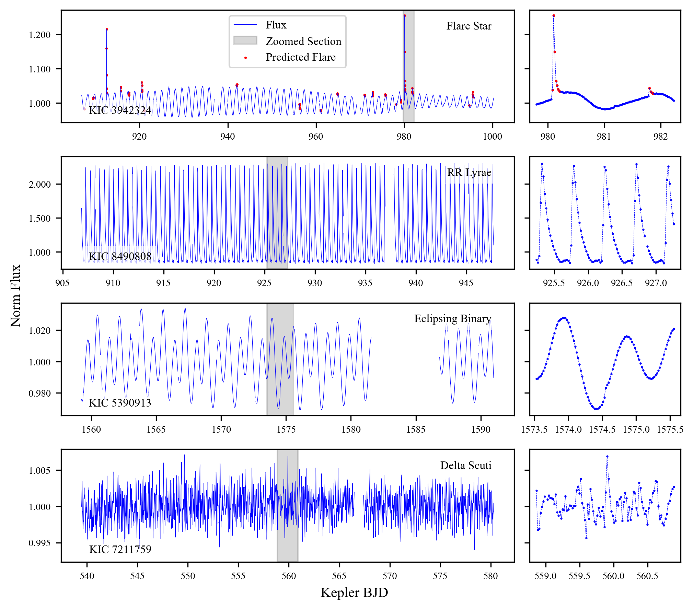
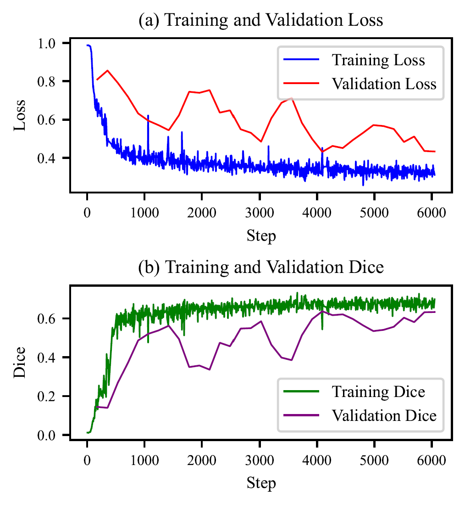
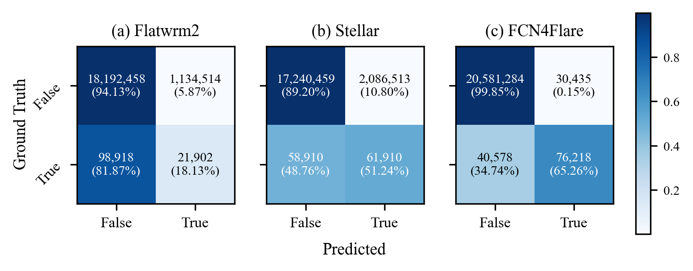

# Weekly Report 2024-04

## 04.22 - 04.28

### Code Recording

#### Plotting Flare Samples with Zoomed Sections

This Python script generates a set of plots showing light curve samples of different types of stars, with zoomed sections highlighting specific features. The data is assumed to be stored in a list of dictionaries with keys 'time', 'flux', and 'pred'.

Key Components:

1. **Data Preprocessing:**
    - The script assumes the existence of a list of dictionaries (`data_list`) containing the light curve data for various stars.
    - `plot_idxs` and `zoom_idxs` store the indices for the full plot range and the zoomed sections, respectively.
    - `star_type` and `kics` store the types of stars and their Kepler Input Catalog (KIC) identifiers, respectively.

2. **Plotting:**
    - The script creates a 4x2 grid of subplots to accommodate the different star samples and their zoomed sections.
    - Each subplot displays the full light curve along with a shaded zoomed section.
    - Points where the predicted flare intensity (`pred`) is greater than 0.5 are highlighted.
    - Annotations for star type and KIC identifier are added to each subplot.

```python
import matplotlib.pyplot as plt
from matplotlib.ticker import FormatStrFormatter
import numpy as np

# Assuming `data_list` is your list of dictionaries with 'time', 'flux', and 'pred' as keys
data_list = res
plot_idxs = [(1, 4573), (1, 2000), (1, 1556), (1, 2000)]  # Indices for full plot range
zoom_idxs = [(3570, 3690), (900, 1000), (700, 800), (950, 1050)]  # Indices for zoomed section
star_type = ['Flare Star', 'RR Lyrae', 'Eclipsing Binary', 'Delta Scuti']  # Types of stars
kics = ['KIC 3942324', 'KIC 8490808', 'KIC 5390913', 'KIC 7211759']  # Kepler Input Catalog (KIC) identifiers

# Resetting the rcParams to default before applying new font settings
plt.rcdefaults()

# Customizing font sizes for better readability in the adjusted figure size
plt.rc('font', family='Times New Roman', size=12)  # Set font family and size
plt.rc('axes', titlesize=9)  # Font size of the axes title
plt.rc('axes', labelsize=8)  # Font size of the x and y labels
plt.rc('xtick', labelsize=7)  # Font size of the tick labels on the x-axis
plt.rc('ytick', labelsize=7)  # Font size of the tick labels on the y-axis
plt.rc('legend', fontsize=8)  # Legend fontsize

# Create the figure and axes
fig, axs = plt.subplots(4, 2, figsize=(17/2.54, 15/2.54), gridspec_kw={'width_ratios': [3, 1]}, dpi=300)

# Iterate through each data and plot
for i, data in enumerate(data_list):
    # Plot the full curve
    plot_start, plot_end = plot_idxs[i]
    axs[i, 0].plot(data['time'][plot_start:plot_end], data['flux'][plot_start:plot_end], 'b-', label='Flux', linewidth=0.3)
    # Set y-axis limits based on the range of data
    y_min, y_max = np.nanmin(data['flux']), np.nanmax(data['flux'])
    y_min -= (y_max - y_min) * 0.05  # Add padding to the bottom of the y-axis
    y_max += (y_max - y_min) * 0.05  # Add padding to the top of the y-axis
    axs[i, 0].set_ylim(y_min, y_max)

    # Shade the zoomed region on the full light curve
    zoom_start, zoom_end = zoom_idxs[i]
    axs[i, 0].axvspan(data['time'][zoom_start], data['time'][zoom_end], color='grey', alpha=0.3, label='Zoomed Section')

    # Highlight points where pred > 0.5
    if i == 0:
        high_pred = [p > 0.5 for p in data['pred']]
        axs[i, 0].scatter([t for t, p in zip(data['time'], high_pred) if p],
                          [f for f, p in zip(data['flux'], high_pred) if p], color='r', label='Predicted Flare', s=0.5)
        # Plot zoomed section with predicted flare points highlighted
        axs[i, 1].plot(data['time'][zoom_start:zoom_end], data['flux'][zoom_start:zoom_end], 'b--', linewidth=0.3)
        axs[i, 1].scatter(data['time'][zoom_start:zoom_end], data['flux'][zoom_start:zoom_end], color='b', s=0.3)
        axs[i, 1].scatter(data['time'][3584:3591], data['flux'][3584:3591], color='r', label='Predicted Flare', s=0.8)
        axs[i, 1].scatter(data['time'][3668:3672], data['flux'][3668:3672], color='r', s=0.8)

        axs[i, 0].legend(loc='upper center')
    else:
        # Plot zoomed section without predicted flare points highlighted
        axs[i, 1].plot(data['time'][zoom_start:zoom_end], data['flux'][zoom_start:zoom_end], 'b--', linewidth=0.3)
        axs[i, 1].scatter(data['time'][zoom_start:zoom_end], data['flux'][zoom_start:zoom_end], color='b', s=0.3)

    # Hide y-axis labels for the right subplot
    axs[i, 1].set_yticklabels([])

    # Set the same y-axis limits as the corresponding left subplot
    axs[i, 1].set_ylim(y_min, y_max)

    # Apply the formatter to each y-axis
    axs[i, 0].yaxis.set_major_formatter(FormatStrFormatter('%.3f'))

    # Adding text annotations for star type and KIC identifier
    axs[i, 0].text(0.95, 0.9, star_type[i], transform=axs[i, 0].transAxes,
                   verticalalignment='top', horizontalalignment='right',
                   fontsize=8, color='black', bbox=dict(facecolor='white', edgecolor='none', alpha=0.7))
    axs[i, 0].text(0.2, 0.15, kics[i], transform=axs[i, 0].transAxes,
                   verticalalignment='top', horizontalalignment='right',
                   fontsize=8, color='black', bbox=dict(facecolor='white', edgecolor='none', alpha=0.7))

# Set common labels
fig.text(0.5, 0.01, 'Kepler BJD', ha='center', va='center', fontsize=10)
fig.text(0.01, 0.5, 'Norm Flux', ha='center', va='center', rotation='vertical', fontsize=10)

# Adjust layout to prevent overlap
plt.tight_layout()
plt.subplots_adjust(hspace=0.3, wspace=0.05)

# Saving the figure as a PDF file
output_pdf_path = "./flare_samples.pdf"
fig.savefig(output_pdf_path, bbox_inches='tight', format='pdf')

# Show the plot
plt.show()
```

result:



**Utils to convert a DataFrame into a [machine-readable table](https://journals.aas.org/mrt-standards/) used by AAS**

```python
def dataframe_to_mrt(df, filename, meta_data, column_specs, notes):
    """
    Converts a pandas DataFrame into a machine-readable table (MRT) format with a detailed header that describes each column,
    including metadata and notes for additional context.

    Parameters:
        df (pandas.DataFrame): The DataFrame to convert.
        filename (str): The name of the file to save the MRT to.
        meta_data (dict): Metadata for the MRT, including title, author, and table name.
        column_specs (list of tuples): A list of tuples, where each tuple contains:
            - Column name (str): The name of the column in the DataFrame.
            - Data format (str): The data format (e.g., 'I9', 'F4.2', 'A9') indicating type and width.
            - Units (str): Measurement units for the column (e.g., 'km', 'mag').
            - Label (str): Label for the column header, used in the MRT.
            - Explanation (str): Description of the column content.
        notes (dict): A dictionary containing notes referenced in the data columns, where keys are note identifiers
                      (e.g., '1', '2') and values are the note text.

    Returns:
        None: Writes the MRT to a file, formatting the DataFrame according to specified column specifications and
              including metadata and notes for clarity and reference.
    """

    with open(filename, 'w') as file:
        # write meta-data
        file.write(f'Title: {meta_data["Title"]}\n')
        file.write(f'Author: {meta_data["Author"]}\n')
        file.write(f'Table: {meta_data["Table"]}\n')
        file.write('=' * 80 + '\n')

        # write the title
        file.write(f'Byte-by-byte Description of file: {filename}\n')
        file.write('-' * 80 + '\n')

        # Determine the maximum units width
        max_units_length = max(len(spec[2]) for spec in column_specs)
        max_label_length = max(len(label.split('_')[-1]) for label, _, _, _ in column_specs)
        max_prefix_length = max((len(label.split('_')[0]) + 1 if '_' in label else 0) for label, _, _, _ in column_specs)
        total_label_width = max_prefix_length + max_label_length
        
        # Write the column description header
        header = '   Bytes Format Units' + ' ' * (max_units_length - 5) + ' ' * max_prefix_length + '  Label' + ' ' * (max_label_length - 5) + '  Explanations\n'
        header += '-' * 80 + '\n'
        
        position = 1
        for spec in column_specs:
            label, fmt, units, explanation = spec
            width = int(fmt[1:].split('.')[0])
            
            if '_' in label:
                prefix, main_label = label.split('_', 1)
                label_formatted = f"{prefix}_{main_label.ljust(max_label_length)}"
            else:
                label = ' ' * max_prefix_length + label
                label_formatted = label.ljust(max_label_length)
            
            header += f"{position:4d}-{position + width - 1:3d} {fmt:6s} {units:{max_units_length}s}  {label_formatted:{total_label_width}s}  {explanation}\n"
            position += width + 1  # Assume 2 spaces between columns for separation
        
        file.write(header + '-' * 80 + '\n')

        # write the notes
        for note_id, note_text in notes.items():
            file.write(f"Note ({note_id}): {note_text}\n")
        file.write('-' * 80 + '\n')
        
        # Write the data rows
        for idx, row in df.iterrows():
            line = ''
            for spec in column_specs:
                label, fmt, units, explanation = spec
                width = int(fmt[1:].split('.')[0])  # Total width of the number
                data_type = fmt[0]
                value = row[label]
                if data_type == 'E':  # Check for scientific notation
                    decimal_places = int(fmt.split('.')[1])  # Get the number of decimal places
                    formatted_value = f"{value:.{decimal_places}e}"  # Format the number in scientific notation
                    line += f"{formatted_value if not np.isnan(value) else ' ':>{width}} "  # Ensure the entire string fits the specified width
                elif data_type == 'F':  # Check for floating point formatting
                    decimal_places = int(fmt.split('.')[1])
                    formatted_value = f"{value:.{decimal_places}f}"  # Format the float with fixed number of decimal places
                    line += f"{formatted_value if not np.isnan(value) else ' ':>{width}} "  # Right-align the formatted float
                elif data_type == 'A':  # Left align strings
                    line += f"{str(value).ljust(width)} "
                else:  # Right align integers
                    line += f"{str(int(value)) if not np.isnan(value) else ' ':>{width}} "

            file.write(line.rstrip() + '\n')
```

Usage sample:

```python
"""
This is the table of `Parameters of Flare Stare` from the paper:
FCN4Flare: Fully Convolution Neural Networks for Flare Detection
Ming-hui Jia, A-Li Luo, Bo Qiu
"""

df = pd.read_csv('parameters_of_flare_stars.csv')

meta_data = {
    'Title': 'FCN4Flare: Fully Convolution Neural Networks for Flare Detection',
    'Author': 'Ming-hui Jia, A-Li Luo, Bo Qiu',
    'Table': 'Parameters of Flare Stars'
}

max_radius = df['Radius'].max()
max_period = df['Period'].max()

column_specs = [
    ('KIC ID', 'I9', '---', 'Kepler Input Catalog identifier'),
    ('Type', 'A2', '---', 'Stellar spectral type'),
    ('Teff', 'I5', 'K', '?Effective temperature'),
    ('log g', 'F5.3', '[cm/s2]', '?log surface gravity'),
    ('[Fe/H]', 'F6.3', '---', '?Metallicity'),
    ('Radius', f'F{len(str(max_radius.round(3)))}.3', 'Rsun', '?Stellar radius'),
    ('Period', f'F{len(str(max_period.round(3)))}.3', 'd', 'Rotation period'),
    ('Tobs', 'F8.3', 'd', 'Observation time by Kepler'),
    ('Tfl/Tobs', 'F5.3', '%', 'Proportion of the flare duration'),
    ('Emax', 'F6.3', 'erg', 'Maximum flare energy'),
    ('Nflare', 'I3', '---', 'Number of flares'),
    ('Lfl/Lbol', 'F6.3', '---', '?Flare activity (1)'),
]

notes = {
    '1': '\n\tCalculate by $\sum E_{flare} / \int L_{bol} dt = L_{flare} / L_{bol}$ \n' 
        '\tas described in Liu, J., & Yang, H. 2019, Astrophysical Journal Supplement Series',
}

dataframe_to_mrt(df, 'flare_star_param.txt', meta_data, column_specs, notes)
```

The returned table is like:

```
Title: FCN4Flare: Fully Convolution Neural Networks for Flare Detection
Author: Ming-hui Jia, A-Li Luo, Bo Qiu
Table: Parameters of Flare Stars
================================================================================
Byte-by-byte Description of file: flare_star_param.txt
--------------------------------------------------------------------------------
   Bytes Format Units    Label     Explanations
--------------------------------------------------------------------------------
   1-  9 I9     ---      KIC ID    Kepler Input Catalog identifier
  11- 12 A2     ---      Type      Stellar spectral type
  14- 18 I5     K        Teff      ?Effective temperature
  20- 24 F5.3   [cm/s2]  log g     ?log surface gravity
  26- 31 F6.3   ---      [Fe/H]    ?Metallicity
  33- 39 F7.3   Rsun     Radius    ?Stellar radius
  41- 47 F7.3   d        Period    Rotation period
  49- 56 F8.3   d        Tobs      Observation time by Kepler
  58- 62 F5.3   %        Tfl/Tobs  Proportion of the flare duration
  64- 69 F6.3   erg      Emax      Maximum flare energy
  71- 73 I3     ---      Nflare    Number of flares
  75- 80 F6.3   ---      Lfl/Lbol  ?Flare activity (1)
--------------------------------------------------------------------------------
Note (1): 
	Calculate by $\sum E_{flare} / \int L_{bol} dt = L_{flare} / L_{bol}$ 
	as described in Liu, J., & Yang, H. 2019, Astrophysical Journal Supplement Series
--------------------------------------------------------------------------------
  7905458 G   4842 4.353 -0.638   1.065  17.642 1459.489 0.592 36.245  73 -4.333
 11495571 dM  3523 4.071  0.570   1.282   9.706 1470.463 0.862 36.173 158 -3.958
 10120296 G   5490 4.369 -0.219   1.109   3.804 1459.489 0.305 36.282  40 -4.237
  2852961 G   4722 2.877 -0.340   7.274  31.755 1470.462 0.185 37.801  14 -4.465
```

## 2024.04.15 - 2024.04.21

### Paper revision

1. `Detection performance` subsection
    - Added introduction of metrics (R, P, F1, AP, AUC, IoU, Dice).
    - Modified description of metrics table to highlight the P, AP, IoU and Dice metrics.
    - Added confusion metrix comparasion for three models.
2. `NaN Mask` subsection
    - Removed paragraphs on data padding for leading to misunderstanding easily.
    - Focused on automated handling of NaN values within light curves instead of manually handling them in previous works.
3. `Data and Training` subsection
    - Figure of loss & dice during training & valuation.
    - Specify the total training time, device, config, etc.
4. `Application` section
    - Deleted comparasion of Yang's.
    - Deleted figure of flare events samples.

### Code Recording

#### Loss (or other metrics) with smoothing.

```python
import matplotlib.pyplot as plt
import pandas as pd
import numpy as np

# Function to smooth the curves with boundary adjustments
def smooth_with_padding(y, box_pts):
    box = np.ones(box_pts) / box_pts
    # Padding the start and end of the data to prevent boundary issues
    y_padded = np.pad(y, pad_width=(box_pts//2, box_pts//2), mode='edge')
    y_smooth = np.convolve(y_padded, box, mode='valid')
    return y_smooth

# Load each CSV file which is export from tensorboard
train_loss = pd.read_csv('./train_loss.csv')
train_dice = pd.read_csv('./train_dice.csv')
val_dice = pd.read_csv('./val_dice.csv')
val_loss = pd.read_csv('./val_loss.csv')

# Applying the adjusted smoothing function
train_loss_smooth_pad = smooth_with_padding(train_loss['Value'], 1)
val_loss_smooth_pad = smooth_with_padding(val_loss['Value'], 3)
train_dice_smooth_pad = smooth_with_padding(train_dice['Value'], 1)
val_dice_smooth_pad = smooth_with_padding(val_dice['Value'], 3)

# Resetting the rcParams to default before applying new font settings
plt.rcdefaults()

# Customizing font sizes for better readability in the adjusted figure size
plt.rc('font', family='Times New Roman', size=12) # Set the font family and size
plt.rc('axes', titlesize=9)  # fontsize of the axes title
plt.rc('axes', labelsize=8)  # fontsize of the x and y labels
plt.rc('xtick', labelsize=7)  # fontsize of the tick labels
plt.rc('ytick', labelsize=7)  # fontsize of the tick labels
plt.rc('legend', fontsize=8)  # legend fontsize

# Setting the figure size to 8cm x 8cm
fig, ax = plt.subplots(2, 1, figsize=(3.15, 3.15), dpi=300)

# Adjusting the subplot parameters for a better layout
plt.subplots_adjust(left=0.15, right=0.95, top=0.92, bottom=0.08, hspace=0.6)

# Loss plot (training and validation) with adjusted smoothing
ax[0].plot(train_loss['Step'], train_loss_smooth_pad, label='Training Loss', color='blue', lw=0.8)
ax[0].plot(val_loss['Step'], val_loss_smooth_pad, label='Validation Loss', color='red', lw=0.8)
ax[0].set_title('(a) Training and Validation Loss')
ax[0].set_xlabel('Step')
ax[0].set_ylabel('Loss')
ax[0].legend()

# Dice plot (training and validation) with adjusted smoothing
ax[1].plot(train_dice['Step'], train_dice_smooth_pad, label='Training Dice', color='green', lw=0.8)
ax[1].plot(val_dice['Step'], val_dice_smooth_pad, label='Validation Dice', color='purple', lw=0.8)
ax[1].set_title('(b) Training and Validation Dice')
ax[1].set_xlabel('Step')
ax[1].set_ylabel('Dice')
ax[1].legend()

# Saving the figure as a PDF file
output_pdf_path = "./training_validation_curves_spacing.pdf"
fig.savefig(output_pdf_path, bbox_inches='tight', format='pdf')
plt.show()
```

结果展示：


#### Confusion Matrix for multi-models

```python
import matplotlib.pyplot as plt
import numpy as np

# Assume there are three different confusion matrices
confusion_matrices = [
    np.array([
        [18192458, 1134514],
        [98918, 21902]
    ]),
    np.array([
        [17240459, 2086513],
        [58910, 61910]
    ]),
    np.array([
        [20581284, 30435],
        [40578, 76218]])
]

# Adjust figsize for better visibility and increase subplot width
fig, axes = plt.subplots(1, 3, figsize=(14/2.54, 6/2.54), dpi=300, sharey=True)  # 1 row, 3 columns
cmap = plt.cm.Blues

# Titles for each subplot
titles = ['(a) Flatwrm2', '(b) Stellar', '(c) FCN4Flare']

for ax, confusion, title in zip(axes, confusion_matrices, titles):
    # Calculate percentage for color representation
    row_sums = confusion.sum(axis=1)
    percent_confusion = confusion / row_sums[:, np.newaxis]

    # Draw the confusion matrix
    cax = ax.imshow(percent_confusion, interpolation='nearest', cmap=cmap)
    ax.set_title(title, fontsize=9)  # Set individual titles

    tick_marks = np.arange(len(['False', 'True']))
    ax.set_xticks(tick_marks)
    ax.set_xticklabels(['False', 'True'], fontsize=8)  # Adjust tick label size
    ax.set_yticks(tick_marks)
    ax.set_yticklabels(['False', 'True'], fontsize=8, rotation=45)

    # Add annotations
    thresh = percent_confusion.max() / 2.
    for i in range(confusion.shape[0]):
        for j in range(confusion.shape[1]):
            percentage = f"{percent_confusion[i, j]:.2%}"
            absolute = f"{confusion[i, j]:,}"
            ax.text(j, i, f"{absolute}\n({percentage})", ha="center", 
                    va="center", fontsize=7, color="white" if percent_confusion[i, j] > thresh else "black")

# Add a common color bar
fig.subplots_adjust(right=0.85)
cbar_ax = fig.add_axes([0.88, 0.15, 0.02, 0.7])  # Position for colorbar
fig.colorbar(cax, cax=cbar_ax)

# Set common labels for axes
fig.text(0.5, 0.1, 'Predicted', ha='center', va='center', fontsize=9)
fig.text(0.05, 0.5, 'Ground Truth', ha='center', va='center', rotation='vertical', fontsize=9)

# Saving the figure as a PDF file
output_pdf_path = "./confusion_matrix.pdf"
fig.savefig(output_pdf_path, bbox_inches='tight', format='pdf')
plt.show()
```

结果展示：


## 2024.04.15

### 【本周工作总结】

1. AIDA 会议，收获最大的报告：刘超老师。
2. FCN4Flare 论文 performance 章节撰写。

### 【下周工作计划】

1. 论文修改。