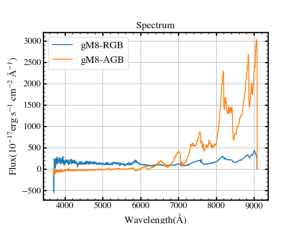

# 工作周报

### 2023.10.14

【本周工作总结】：

1、AGB文献总结：阅读总结AGB搜寻方法35篇左右；

2、AGB文献搜集：新搜集AGB搜集相关文章3篇左右；

3、知识学习：B站薛永泉老师《天文学导论》概览。

【下周工作计划】：

1、AGB文献总结：完成阅读总结所有的AGB搜寻方法及样本情况；

2、AGB文献搜集：查看搜集结果是否完全，如不完全，继续进行搜集；

3、知识学习：学习陈静师姐的代码。

### 2023.10.22

【本周工作总结】：

1、AGB文献总结：完成阅读总结所有的样本情况（10篇），搜寻方法（21篇）；

2、AGB文献搜集：新搜集AGB搜集相关文章3篇左右；

3、知识学习：B站李宏毅老师《机器学习与深度学习》；听StarWisper大语言模型分享汇报。

【下周工作计划】：

1、AGB文献总结：完成阅读总结所有的AGB搜寻方法；

2、AGB文献搜集：继续进行搜集；

3、知识学习：学习陈静师姐的代码SVM部分。

### 2023.10.29

【本周工作总结】：

1、文献搜集：新下了62篇文献。
 
2、文献总结：其中14篇是在讲如何搜寻AGB，做了它们的总结，新增了1个新的搜寻方式文献方向。剩余的其它的大部分都是拿现成的星表做后续科学研究。
 
3、文献阅读及PPT制作：《Scientific discovery in the age of artificial intelligence》。

【下周工作计划】：

1、继续进行文献总结及搜寻工作。

2、学习画图代码。

### 2023.11.04
【本周工作总结】：

1、文献搜集：本周新下了10篇左右文献；

2、文献总结：新增4篇搜集方法的文献，新增2个AGB搜集方向（IRTS测光、射电波段），详读理解了5篇重点文献，包括一篇50页的AGB星表综述型《A New Catalog of Asymptotic Giant Branch Stars in Our Galaxy》；

3、检查光谱rv值。

【下周工作计划】：

1、继续进行文献总结及搜寻工作；

2、学习画图代码。

### 2023.11.12
【本周工作总结】：

文献总结：完成搜集方式及Motivation的文献总结；

【下周工作计划】：

1、光谱检查：检查光谱rv值。
2、总结汇报。

### 2023.11.19
【本周工作总结】：

文献总结：完成搜集方式及Motivation的文献汇报；

【下周工作计划】：

1、协助画图。 2、完善文献阅读。

### 2023.11.26

【本周工作总结】：

1、协助画图。 2、完善文献阅读。

【下周工作计划】：

1、完善文献阅读。 2、总结画图经验，组会分享。

### 2023.12.02

【本周工作总结】：

1、完善文献阅读； 
2、协助topcat处理数据，Latex处理表格数据；
3、总结画图经验，组会分享。

【下周工作计划】：

1、完善文献阅读。 
2、文献总结。

### 2023.12.09
【本周工作总结】：

1、文献阅读找寻Motivation； 2、文献阅读总结现有的搜寻方法； 3、开题报告撰写。

【下周工作计划】：

1、完善开题报告； 2、完成开题答辩PPT。

### 2023.12.16
【本周工作总结】：

1、完成开题报告； 2、完成开题答辩PPT及讲稿；3、完成开题登记表。

【下周工作计划】：

1、完成画图；2、完善开题报告；3、完成答辩秘书的相关准备工作。

### 2023.12.23
【本周工作总结】：

1、完成画图；2、完善开题报告；3、完成答辩秘书的相关准备工作。

【下周工作计划】：

1、完成答辩秘书的相关准备工作；2、进行开题答辩报告；3、修改画图。

### 2023.12.27
【本周工作总结】：

1、完成答辩秘书的相关准备工作；2、进行开题答辩报告；3、修改画图。

【下周工作计划】：

1、进行RGB和AGB的可分性分析；2、准备PPT汇报；3、继续答辩秘书的后续工作。

### 2024.01.06
【本周工作总结】：

1、进行RGB和AGB的可分性分析；2、准备PPT汇报（开题回顾）；3、进行答辩秘书的部分后续工作。

【下周工作计划】：

1、继续进行RGB和AGB的可分性分析；2、参加MESA的学习讨论会。

### 2024.01.14
【本周工作总结】：

1、继续进行RGB和AGB的可分性分析；2、参加MESA的学习讨论会。

【下周工作计划】：

1、收集RGB和AGB的星表，跑一下分类算法看准确率；2、参加MESA的学习讨论会。

### 2024.01.21
【本周工作总结】：

1、收集RGB和AGB的星表；2、下载RGB和AGB光谱看二者差异；3、参加MESA的学习讨论会。

以下是显示二者差异的光谱展示图：代码参考链接——https://zhuanlan.zhihu.com/p/353938168

```python
import matplotlib.pyplot as plt
import matplotlib.image as mpimg

# 读取图片
img = mpimg.imread('D:/PhD/画图/光谱图/eye_inspect_result/gM8_RGB_2_gM8_AGB.png')

# 显示图片
plt.imshow(img)
plt.axis('off')
plt.show()
```



【下周工作计划】：

1、预处理RGB和AGB的光谱，跑一下分类算法看准确率；2、继续收集M-AGB和M-RGB的星表。

### 2024.01.28
【本周工作总结】：
1、弄清AGB星表下载方法；2、收集测光的M-AGB星表；3、看分类代码程序；4、调研可解释性机器学习算法。

【下周工作计划】：
1、把不同光谱型的M-AGB和M-RGB画到同一张图上，人眼对比差异；2、安装ChatGPT4；3、看一下Fits说明；4、继续调研可解释性机器学习算法。

### 2024.02.25

【本周工作总结】： 1、多模态论文阅读及分享；

【下周工作计划】： 1、把不同光谱型的M-AGB和M-RGB画到同一张图上，人眼对比差异；2、阅读目前的论文研究方向，思考后续可做的课题。

### 2024.03.03
【本周工作总结】： 1、把不同光谱型的M-AGB和M-RGB画到同一张图上，人眼对比差异；2、阅读目前的论文研究方向，思考后续可做的课题。

【下周工作计划】： 1、调研M-AGB搜寻方法；2、学习AGB的星表类论文。

### 2024.03.10
【本周工作总结】： 1、人眼对比M巨星和M矮星的光谱差异；2、人眼对比不同光谱型的M-AGB和RGB的差异；3、搜集（O-rich）M-AGB和RGB的星表。

【下周工作计划】： 1、对扩充后的样本进一步整理，人眼观察差异；2、学习AGB的星表类论文。

### 2024.03.17
【本周工作总结】： 1、学会辨认M巨星和M矮星，以及S型星的光谱；2、对扩充后的样本进行整理，人眼观察差异；3、讨论下一步工作。

【下周工作计划】： 1、学会使用sklearn库；2、整理输入数据；3、运行程序进行分类，并进行模型调参。

### 2024.03.24
【本周工作总结】： 1、学会使用sklearn、autoGluon库；2、整理输入数据；3、运行程序进行分类，跑了XGBoost和SVM。

【下周工作计划】： 1学会认S型星库；2过一遍《实用机器学习》&李宏毅调参部分课程
；数整理sklearn各个算法的优劣比较；4、阅读理解学位论文，写出研究方案。
模型调参。

### 2024.03.31
【本周工作总结】： 1、学会认S型星；2、过一遍《实用机器学习》和李宏毅调参部分课程；3、整理sklearn各个算法的优劣比较；4、阅读理解学位论文，写出研究方案。

【下周工作计划】： 1、讨论后续研究方案；2、研究参数调试方法。

### 2024.04.07
【本周工作总结】：1、讨论后续研究方案；2、完成正/负样本准备。


第【1】步：准备样本（已完成）
正样本构成：1,661 (星表来源：ChenJ-S catalogue + Suh Kwon-S catalogue)
负样本构成：1,700（星表来源：随机抽取star catalogue DR10 - 1,661颗S）

初步分类结果：SVM（acc: 90.34%），XGBoost（acc: 94.06%）
（训练集:测试集 = 8:2）

【下周工作计划】： 研究autogluon参数调试方法方案；降维+跑模型方法。

### 2024.04.14
【本周工作总结】：1、Latex文档编辑+流程图框图制作；2、autogluon各个分类模型结果画图；3、调研各个分类算法的适用范围。

【下周工作计划】： 1、完成autogluon对各个模型的初步测评分类结果；2、完成Latex图表；3、阅读AGB文章；4、补充S型星星表；5、进行算法调研。